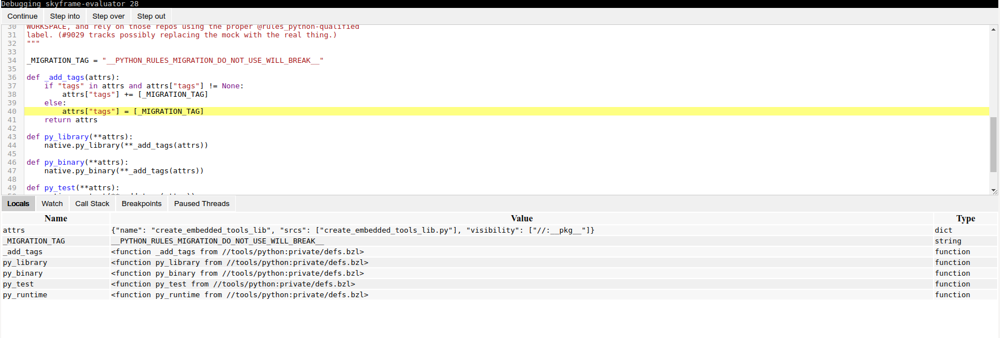

# Experimental debugger for Starlark

This is a standalone debugger for Starlark ,with a web-based UI. In theory, it
can be used to debug any Starlark code that uses the same debugging protocol. At
the moment, the only known compatible server is Bazel.

This is the first draft, there are lots of rough edges and known limitations.




## Example of use

1. Run your normal Bazel command with `--experimental_skylark_debug`, e.g.

```
bazel build --experimental_skylark_debug //my:target
```

The command will hang until a debugger is attached.

2. In a different shell, run the debugger from the stardbg repository. Choose
  where you want your initial breakpoints using an absolute path and a line
  number, e.g.

```
bazel run :stardbg -- /home/myself/dir/my/BUILD.bazel:3
```

Of course, the file should be inside the repository you are debugging (a file
used by `//my:target`).

3. Open a browser at http://localhost:8080/


## Caveats

* A breakpoint will be effective only when the corresponding line is evaluated.
  Since Bazel aggressively caches the results, you may want to do a spurious
  change to a file to force a re-evaluation.

* At the moment, you need to kill and rerun the debugger each time you restart a
  debugging session. Also, reload the web page.

* Supported features: display of local variables (in each level of the
  stack trace), support for threads (you can choose which thread to debug,
  switch thread, etc.).

* Missing features: conditional breakpoints, evaluation of custom expressions.
  The visualization of values is very limited.


## Alternative

* The VS Code plugin for Bazel supports the same protocol: https://github.com/bazelbuild/vscode-bazel#using-the-starlark-debugger
